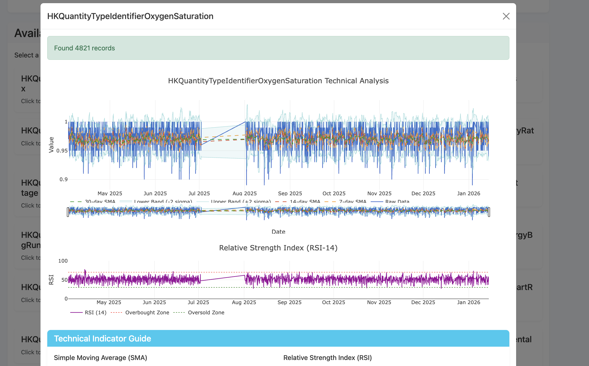
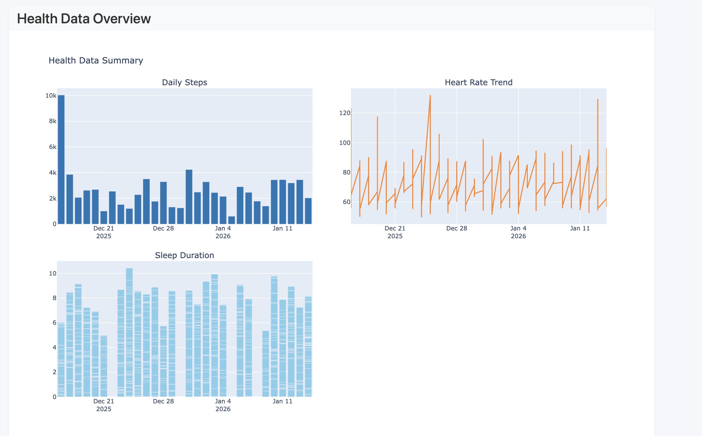
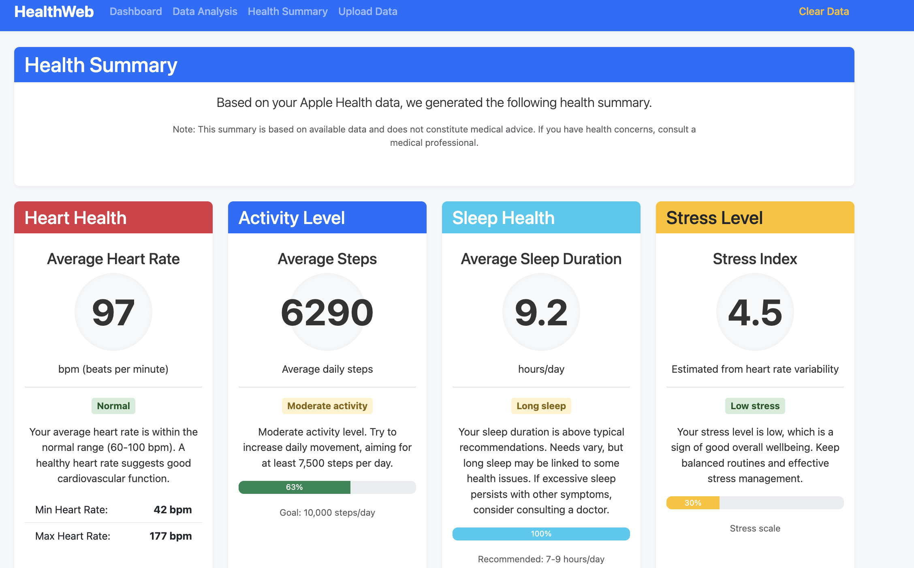
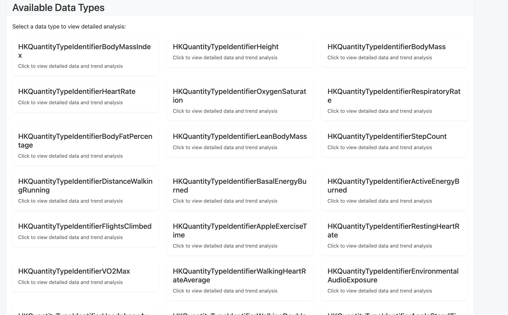

# SeeMyStats - Apple Watch Data Analytics Platform / Data Visualization Platform

> **Note:**  
> This project is no longer maintained.  
> This project is for demonstration and educational use only.  
> All visualizations shown do not constitute medical advice.  
> Please do not rely on this system for clinical decisions.  
> Consult licensed medical professionals if you have health concerns.

## ✨ Core Features

### 🔬 Technical Analysis
- **Moving Average Analysis:** 7-day, 14-day, 30-day SMA to identify health trends.
- **Relative Strength Index (RSI):** Detect abnormal fluctuations in health metrics.
- **Bollinger Bands:** Identify abnormal data ranges based on standard deviation.
- **Average True Range (ATR):** Quantify volatility in health data.

### 📈 Interactive Visualization
- **Box Select:** Precisely select specific data ranges for analysis.
- **Lasso Select:** Free-form selection of data points.
- **Multi-level Zoom:** Seamless zooming from macro trends to micro details.

### 🧠 Data Analysis
- **Multivariate Correlation Analysis:** Discover relationships between different health indicators.
- **Statistical Significance Testing:** Scientifically validate data correlations.



## 🚀 Functional Modules / Features

### 📊 Dashboard System
- Real-time health data overview  
- Multi-metric visualization  



### 📱 Data Management
- Apple Health XML data import  
- Multi-format data support  
- Data cleaning & preprocessing  



## 🛠️ Tech Stack

### Backend
Flask 2.3.3
Pandas 2.0.3
NumPy 1.24.3
Matplotlib 3.7.2
Plotly 5.16.1

shell
Copy code

### Frontend
Bootstrap 5
Plotly.js
JavaScript ES6+

shell
Copy code

### Data Processing
XMLtoDict 0.13.0
BeautifulSoup 4.12.2
lxml 4.9.3

bash
Copy code



## 📦 Quick Start

### Requirements
- Python 3.8+
- 8GB+ RAM
- Modern browser support (Chrome, Firefox, Safari)

### Installation
```bash
git clone https://github.com/yourusername/healthweb.git
cd healthweb
python -m venv venv
source venv/bin/activate  # or venv\Scripts\activate (Windows)
pip install -r requirements.txt
python run.py
Open browser and visit:
http://127.0.0.1:5000

📋 Usage Guide
Data Import Flow
Export health data from Apple Health on iPhone

Click "Upload Data" and select ZIP or XML file

Wait for parsing and start analysis

Supported Data Types
Physiological Metrics

Heart Rate & HRV

Body Temperature

Activity Data

Steps

Distance

Sleep Health

Sleep Duration

📄 License
This project is licensed under the MIT License.
See LICENSE file for details.

🙏 Acknowledgements
Apple Health team for data standards

Plotly community for excellent visualization libraries

Flask community for framework support

📌 Disclaimer
This platform is for demonstration and educational purposes only.
All health charts and analyses do not constitute medical advice.
Do not use this system for clinical diagnosis or treatment decisions.
If you have health concerns, please consult a licensed medical professional.

This platform is for demonstration and educational use only.
All visualizations and analytics shown do not constitute medical advice.
Please do not rely on this system for clinical decisions.
Consult licensed medical professionals if you have health concerns.
'''
